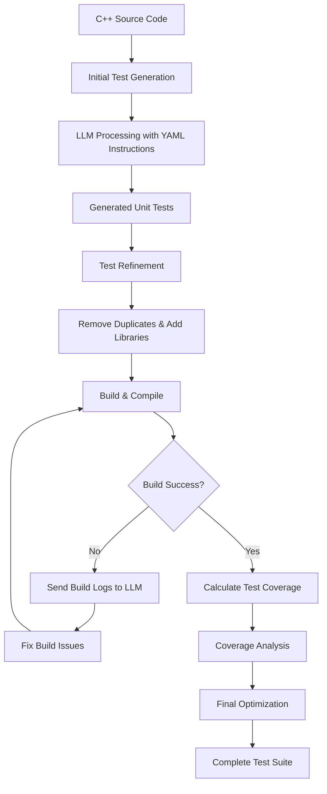

# C++ Unit Test Generator

An AI-powered unit test generator for C++ applications that automatically creates, refines, and optimizes unit tests using Large Language Models (LLMs).

## 📁 Project Structure

```
cpp-string-utils/
├── .vscode/                    # VSCode configuration
├── build/                      # Build output directory
│   ├── CMakeFiles/            # CMake generated files
│   ├── cmake_install.cmake    # CMake install configuration
│   ├── CMakeCache.txt         # CMake cache
│   ├── Makefile              # Generated Makefile
│   └── runTests              # Test executable
├── deps/                      # External dependencies
│   └── googletest/           # Google Test framework
├── src/                       # Source code
│   ├── string_utils.cpp      # Implementation file
│   └── string_utils.h        # Header file
├── tests/                     # Generated unit tests
│   └── string_utils_test.cpp # Test file
└── CMakeLists.txt            # CMake configuration
```

## 🎯 Overview

This project demonstrates an AI-powered workflow for generating comprehensive unit tests for C++ applications. The system uses LLMs to automatically create, refine, and optimize unit tests based on the provided C++ code.

## 🔧 Prerequisites

### Required Tools
- **C++ Compiler**: GCC 7.0+ or Clang 6.0+
- **CMake**: Version 3.10 or higher
- **Git**: For dependency management
- **Python**: 3.7+ (for AI model integration)
- **GNU Coverage Tools**: `gcov` and `lcov` for test coverage

### AI Model Options
Choose one of the following:
- **Ollama**: Self-hosted LLM (recommended for privacy)
- **GitHub Models**: GitHub-hosted AI models
- **OpenAI API**: GPT-3.5/4 (requires API key)
- **Hugging Face**: Open-source models
- 
### Output


## 🚀 Setup Instructions

### 1. Environment Setup

```bash
# Clone the repository
git clone <repository-url>
cd cpp-string-utils

# Create build directory
mkdir -p build
cd build

# Configure CMake
cmake ..

# Build the project
make
```

### 2. Install Dependencies

```bash
# Install Google Test (if not already present)
cd deps
git clone https://github.com/google/googletest.git
cd googletest
mkdir build && cd build
cmake ..
make install
```

### 3. Install Coverage Tools

```bash
# Ubuntu/Debian
sudo apt-get install gcov lcov

# macOS
brew install lcov

# CentOS/RHEL
sudo yum install gcc lcov
```

## 🤖 AI Model Integration

### Option 1: Ollama (Recommended)

```bash
# Install Ollama
curl -fsSL https://ollama.ai/install.sh | sh

# Pull a suitable model
ollama pull llama2:7b
# or
ollama pull codellama:7b
```

### Option 2: GitHub Models

```bash
# Set up GitHub CLI
gh auth login

# Configure GitHub Models access
export GITHUB_TOKEN="your_github_token"
```

## 📋 Workflow Architecture

The unit test generator follows this workflow:



## 🔄 Usage Steps

### Step 1: Initial Test Generation

```bash
# Generate initial tests using AI
python scripts/generate_tests.py \
  --source src/string_utils.cpp \
  --header src/string_utils.h \
  --output tests/ \
  --model ollama:llama2
```

### Step 2: Test Refinement

```bash
# Refine generated tests
python scripts/refine_tests.py \
  --tests tests/string_utils_test.cpp \
  --model ollama:llama2 \
  --config config/refinement.yaml
```

### Step 3: Build and Test

```bash
# Build with tests
cd build
cmake ..
make

# Run tests
./runTests

# Generate coverage report
make coverage
```

### Step 4: Coverage Analysis

```bash
# Generate detailed coverage report
lcov --capture --directory . --output-file coverage.info
genhtml coverage.info --output-directory coverage_html
```

## 📝 YAML Configuration Files

### Initial Generation Config (`config/generation.yaml`)

```yaml
generation:
  framework: "Google Test"
  test_types:
    - unit_tests
    - edge_cases
    - boundary_tests
  coverage_target: 85
  include_mocks: true
  test_naming: "descriptive"
  
instructions:
  - "Generate comprehensive unit tests for each public function"
  - "Include edge cases and boundary conditions"
  - "Use Google Test framework (gtest)"
  - "Follow C++ best practices"
  - "Add proper test documentation"
```

### Refinement Config (`config/refinement.yaml`)

```yaml
refinement:
  remove_duplicates: true
  add_missing_includes: true
  optimize_test_structure: true
  validate_assertions: true
  
quality_checks:
  - "Remove duplicate test cases"
  - "Ensure proper setup/teardown"
  - "Validate all assertions"
  - "Check for memory leaks"
  - "Optimize test performance"
```

### Build Fix Config (`config/build_fix.yaml`)

```yaml
build_fix:
  analyze_errors: true
  fix_compilation: true
  resolve_dependencies: true
  update_cmake: true
  
error_handling:
  - "Analyze compilation errors"
  - "Fix missing includes"
  - "Resolve linking issues"
  - "Update CMakeLists.txt if needed"
```

## 📊 Test Coverage

### Coverage Goals
- **Minimum Coverage**: 80%
- **Target Coverage**: 90%+
- **Critical Functions**: 100%

### Coverage Reports
- **HTML Report**: `build/coverage_html/index.html`
- **Summary**: `build/coverage_summary.txt`
- **Detailed**: `build/coverage_detailed.info`

## 🧪 Example Test Output

```cpp
// Generated test example
TEST(StringUtilsTest, TrimWhitespace_RemovesLeadingAndTrailingSpaces) {
    std::string input = "  hello world  ";
    std::string expected = "hello world";
    std::string result = StringUtils::trim(input);
    EXPECT_EQ(expected, result);
}

TEST(StringUtilsTest, TrimWhitespace_EmptyString) {
    std::string input = "";
    std::string expected = "";
    std::string result = StringUtils::trim(input);
    EXPECT_EQ(expected, result);
}
```

## 🛠️ Build Commands

```bash
# Clean build
make clean

# Build with debug info
cmake -DCMAKE_BUILD_TYPE=Debug ..
make

# Build with coverage
cmake -DCMAKE_BUILD_TYPE=Coverage ..
make

# Run specific test
./runTests --gtest_filter="StringUtilsTest.*"

# Run with verbose output
./runTests --gtest_verbose
```

## 📈 Performance Metrics

- **Test Generation Time**: ~2-5 minutes per source file
- **Build Time**: ~30 seconds for full rebuild
- **Test Execution**: ~1-2 seconds for all tests
- **Coverage Analysis**: ~10-15 seconds

## 🔍 Troubleshooting

### Common Issues

1. **Build Failures**
   - Check CMake version compatibility
   - Verify Google Test installation
   - Ensure all dependencies are met

2. **AI Model Issues**
   - Verify model installation
   - Check API keys/tokens
   - Validate network connectivity

3. **Coverage Problems**
   - Install gcov/lcov tools
   - Check compiler flags
   - Verify test execution

### Debug Commands

```bash
# Verbose build
make VERBOSE=1

# Debug test execution
./runTests --gtest_break_on_failure

# Check coverage data
lcov --list coverage.info
```

## 📚 Additional Resources

- [Google Test Documentation](https://google.github.io/googletest/)
- [CMake Tutorial](https://cmake.org/cmake/help/latest/guide/tutorial/)
- [GNU Coverage Tools](https://gcc.gnu.org/onlinedocs/gcc/Gcov.html)
- [Ollama Documentation](https://ollama.ai/docs)

## 🤝 Contributing

1. Fork the repository
2. Create a feature branch
3. Add tests for new functionality
4. Ensure all tests pass
5. Submit a pull request

## 📄 License

This project is licensed under the MIT License - see the LICENSE file for details.

## 🏆 Success Criteria

- ✅ Automated test generation
- ✅ 85%+ code coverage
- ✅ Zero compilation errors
- ✅ All tests passing
- ✅ Optimized test structure
- ✅ Comprehensive documentation

---

**Note**: This README is specific to the `cpp-string-utils` project structure shown in the image. Adjust paths and configurations based on your specific implementation.
